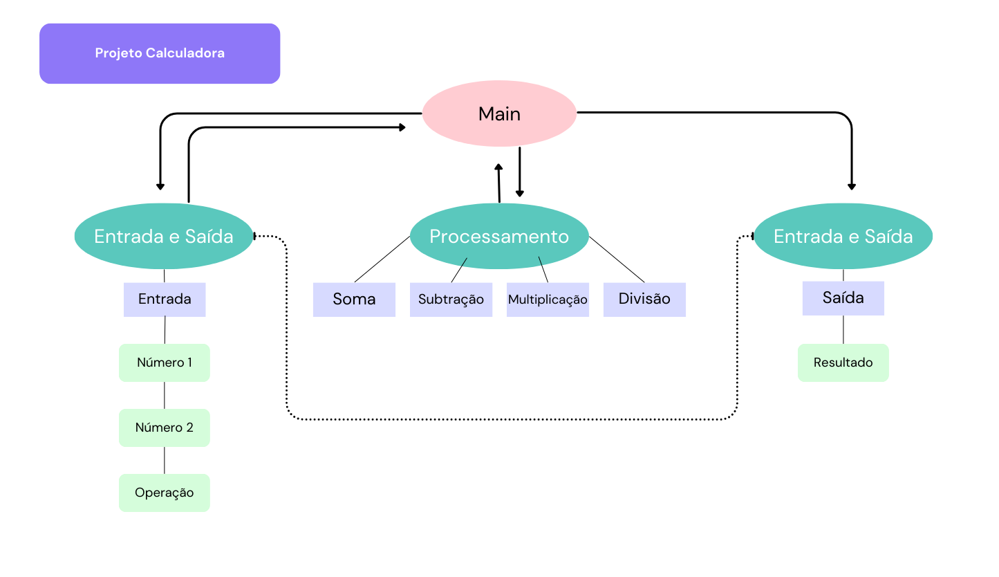

# Projeto de arquitetura

Este aplicativo será desenvolvido com programação matemática, com uma estrtura voltada para a lógica RPN, tal a calculadora HP. Com isso, precisamos estabelecer uma entrada que solicite:

1. Primeiro número
2. Segundo número
3. Operação matemática

## Módulo de Entrada e Saída de Dados

A entrada de dados será feita pelo usuário, via teclado, inserindo os dois números e a operação desejada.

A saída informará ao usuário o resultado do cálculo executado.

## Módulo de Processamento de Dados

Este módulo processará o cálculo de acordo com os dados inseridos pelo usuário.

## Módulo principal

Este é o módulo com a função principal que integra as fases de entrada, processamento e saída de dados.

## Desenho do projeto

É possível ver o desenho dessa arquitetura em png.

