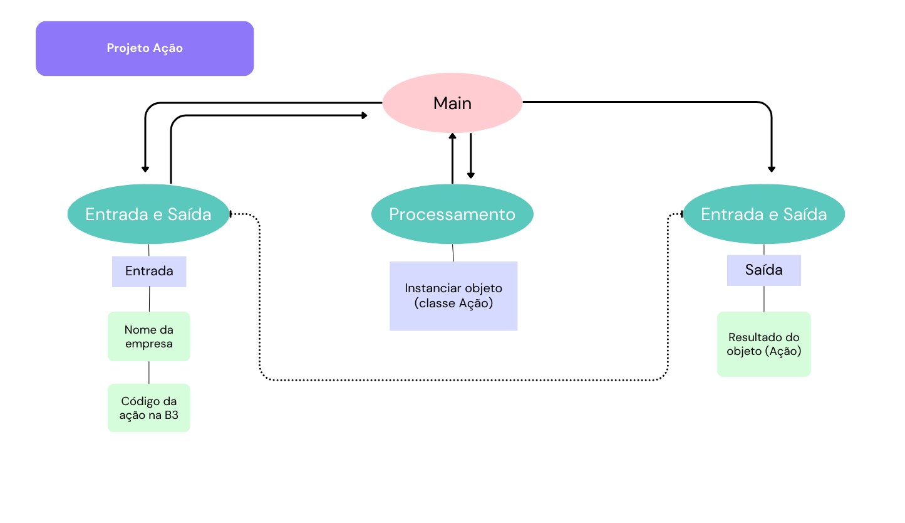

# Projeto de arquitetura

Este aplicativo será desenvolvido com programação orientada a objetos e a ação será representada por um objeto que possui as seguintes características:

1. Atributos:

Razão Social (emissor)

Código B3

2. Funcionalidades:

Negociar (compra e venda)

## Módulo de Entrada e Saída de Dados

A entrada de dados será feita pelo usuário, via teclado, inserindo as características da ação.

A saída informará ao usuário que foi criado o objeto computacional que representa a ação de acordo com os dados inseridos por ele.

## Módulo de Processamento de Dados

Este módulo instanciará um objeto da classe Ação com as características inseridas pelo usuário.

## Módulo principal

Este é o módulo com a função principal que integra as fases de entrada, processamento e saída de dados.

## Desenho do projeto

É possível ver o desenho dessa arquitetura em png.:

