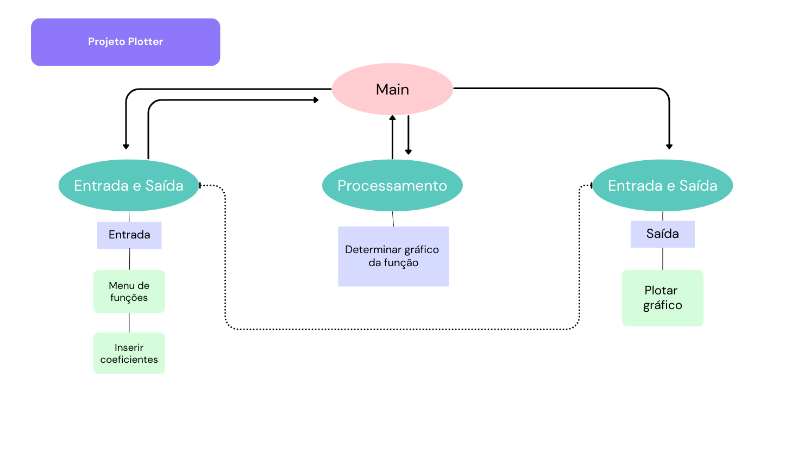

## Projeto de arquitetura

A aplicação terá os seguintes módulos:
1. módulo de entrada e saída de dados (requisitos 2, 3 e 4)
2. módulo de processamento de gráficos (requisito 1)

## Desenho do projeto

É possível ver o desenho dessa arquitetura em png.:

