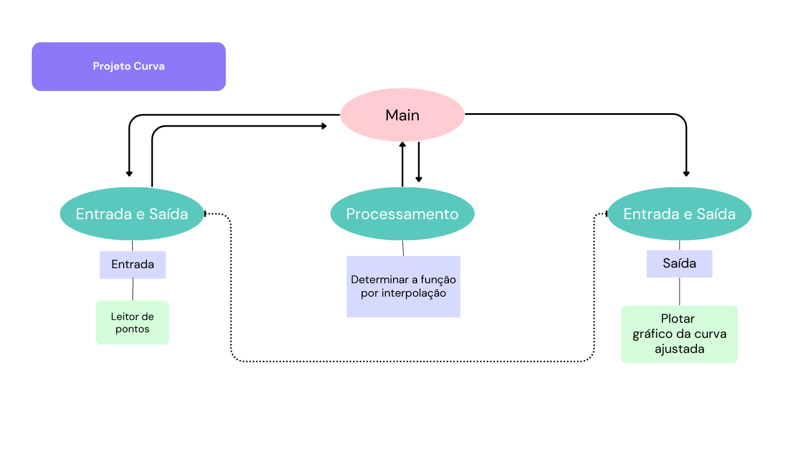

# Projeto de arquitetura

Este documento apresenta o projeto de arquitetura para o desenvolvimento de um Aplicativo de Ajuste de Curva de Dados.

O aplicativo terá os seguintes módulos:
1. Módulo de entrada e saída de dados (requisitos 1 e 3)
2. Módulo de processamento com interpolação (requisito 1)

## Módulo de entrada e saida

Oferece duas funções: uma para atender ao requisito 1 e outra para o requisito 3

Na fase de entrada:

### Requisito 1

Ler dados com duas coordenadas.

Função leitora() -> lista com pontos

Esta função receberá os dados de cada ponto inseridos pelo usuário.

Na etapa de saída:

### Requisito 3

Plotar o gráfico com a função dos pontos de duas coordenadas.

Função plota_curva(lista com pontos) e imprimir o gráfico

Esta função gera o gráfico com o resultado do ajuste de curva dos pontos inseridos pelo usuário. 

## Módulo de interpolação

Para atender ao requisito 2:

### Requisito 2

Determinar a função formada pela lista de dados.

Função interp(lista com pontos) -> funções
Esta função será responsável por processar os pontos, através de interpolação, e encontrar a função que ajusta a curva.

## Desenho do projeto

É possível ver o desenho dessa arquitetura em png.:

