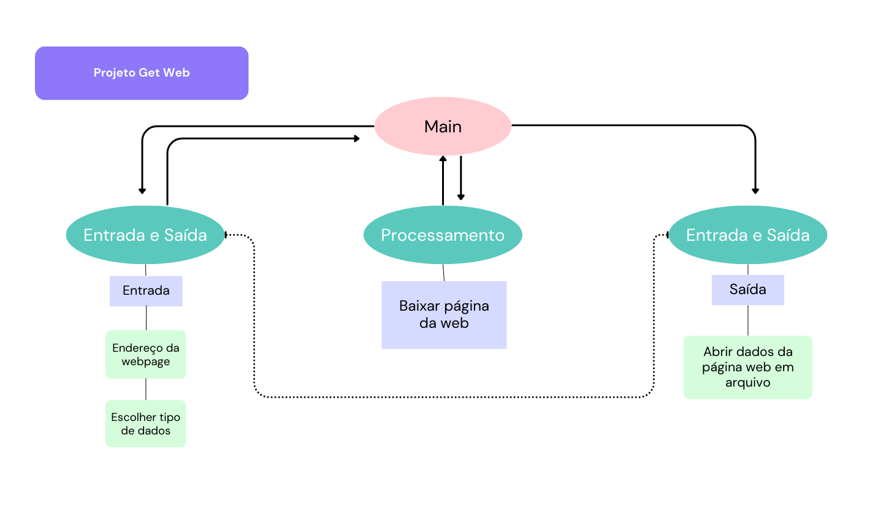

# Projeto de arquitetura

Este documento apresenta o projeto de arquitetura para o desenvolvimento do Aplicativo de Coleta de Dados na Web.

O aplicativo terá os seguintes módulos:
1. Módulo de entrada e saída de dados (requisitos 1 e 3)
2. Módulo de processamento ao coletar dados da web (requisito 2)

## Módulo de entrada e saida

Este módulo oferece duas funções, sendo uma para atender ao requisito 1 e outra para o requisito 3. 

### Requisito 1

1. Permitir que o usuário entre com o endereço de uma página web.

Na entrada, deve haver uma função que solicita ao usuário a inserção do nome da página web desejada e o tipo de dado a ser requerido.

A função terá a seguinte assinatura:

Função leitora() -> list[pagina, dado]

### Requisito 3

3. Abrir a página web para o usuário.

Na fase de saída, deve haver uma função que imprime para o usuário a página web requerida.

A função terá a seguinte assinatura:

Função impressora_web(arquivo_web) -> None

## Módulo de baixar página web

### Requisito 2

2. Baixar a página web requerida pelo usuário.

Para atender ao requisito 2, este módulo prevê uma função capaz de baixar página web.

A função terá a seguinte assinatura:

Função get_web(pagina, dado) -> file

## Desenho do projeto

É possível ver o desenho desse projeto de arquitetura em png.:

