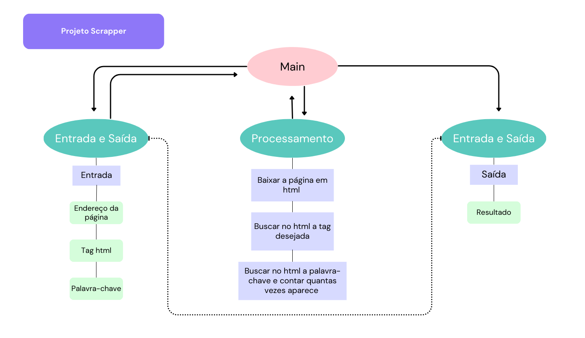

# Projeto de Arquitetura

Este documento apresenta o projeto de arquitetura para o desenvolvimento do aplicativo de extração de dados em texto.

O aplicativo terá os seguintes módulos:
1. Módulo de entrada e saída de dados
2. Módulo de processamento de dados da página html

## Módulo de Entrada e Saída

### Entrada de dados

Fase para solicitar ao usuário os dados necessários para atender aos requisito 1, 2 e 3:

Função leitor()
Esta função receberá o link da página, a tag html e a plavra-chave a ser buscada

### Saída de dados

Fase para imprimir ao usuário os resultados do scraping da página.

Função saida(soup, tag, palavra_chave, contagem)
Esta função irá imprimir na tela do usuário o resultado da tag buscada e o resultado de quantas vezes a palavra-chave foi encontrada.

## Módulo de Processamento

- Requisito 1 - Baixar a página web em html

Função leitor_web(endereco_web)
Esta função irá baixar a página html escolhida pelo usuário.

- Requisito 2 - Buscar no html a tag desejada (como o título)
- Requisito 3 - Informar quantas vezes uma palavra-chave foi encontrada

Função extrator(pagina_web, tag, palavra_chave)
Esta função irá extrair da pagina html a tag e a palavra-chave desejada.

## Desenho do projeto

É possível ver o desenho desse projeto de arquitetura em imagem:

