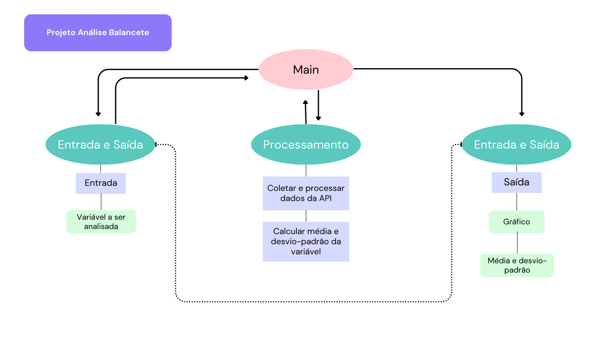

# Projeto de Arquitetura

Este documento apresenta o projeto de arquitetura para o desenvolvimento do aplicativo de análise de dados.

O aplicativo terá os seguintes módulos:
1. Módulo de entrada e saída de dados
2. Módulo de processamento de dados

## Módulo de Entrada e Saída

### Entrada de dados

Fase para solicitar ao usuário a escolha da variável do Balancete de despesa consolidado 2023 que deve ser analisada.

Função leitor_dados(url)
Esta função inicia o processamento dos dados em CSV, usando a API de dados abertos do TCE-RS

Função variavel()
Esta função recebe do usuário a definição que qual variável financeira a ser analisada.

### Saída de dados

- Requisito 2 (RU2) - Plotar o gráfico dos dados

Função plotador(dados)
Esta função irá apresentar ao usuário o gráfico dos dados analisados.

Função impressora(resultados)
Esta função irá imprimir para o usuário os resultados da média e do desvio-padrão calculados.

## Módulo de Processamento

- Requisito 1 (RU1) - Coleta de dados

Função coleta_dados(api_tce, variavel)
Esta função irá realizar a análise dos dados da variável escolhida, usando a API de dados abertos do TCE-RS.

- Requisito 3 (RU3) - Calcular média e desvio-padrão dos dados

Função media_desv(dados)
Esta função irá calcular a média e o desvio-padrão da variável financeira dos dados escolhida.

## Desenho do projeto

É possível ver o desenho desse projeto de arquitetura em imagem:

